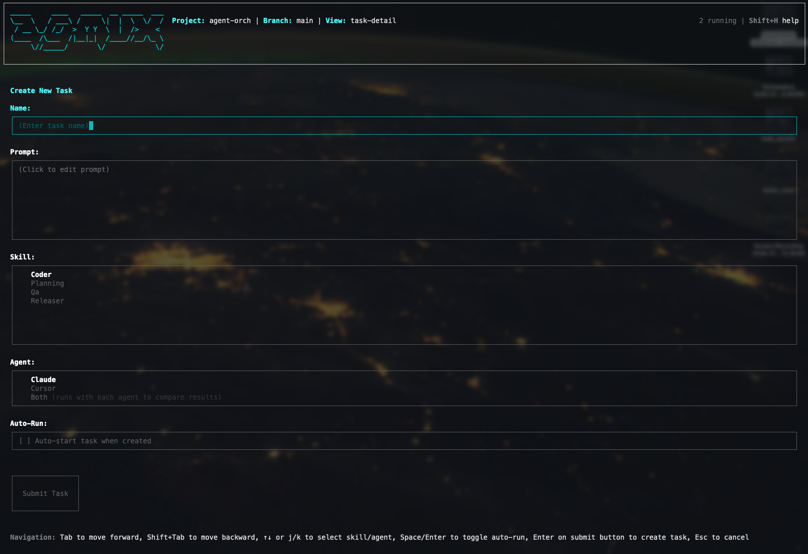
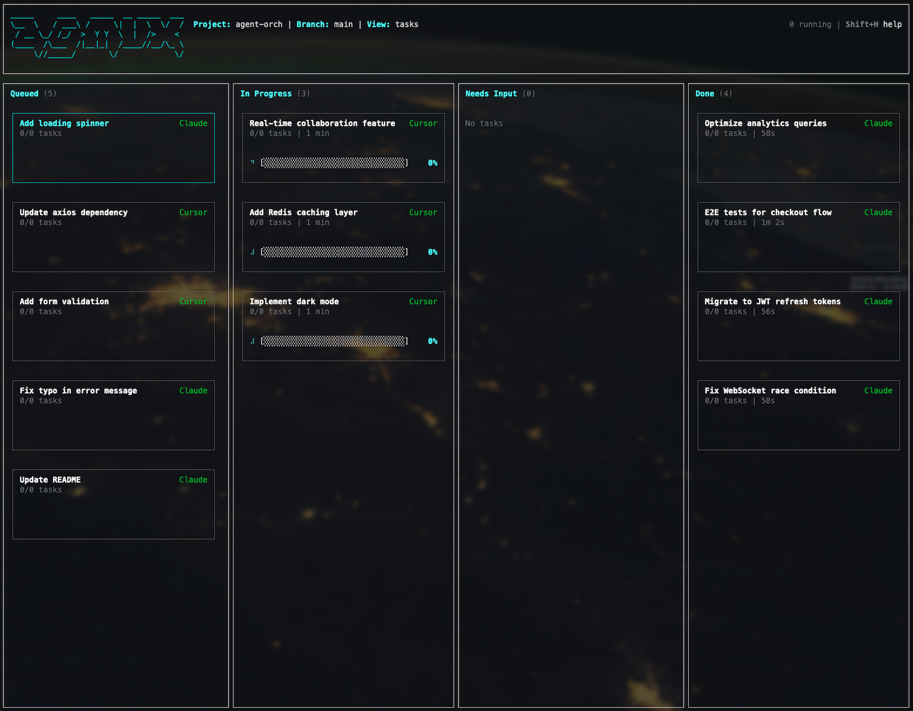
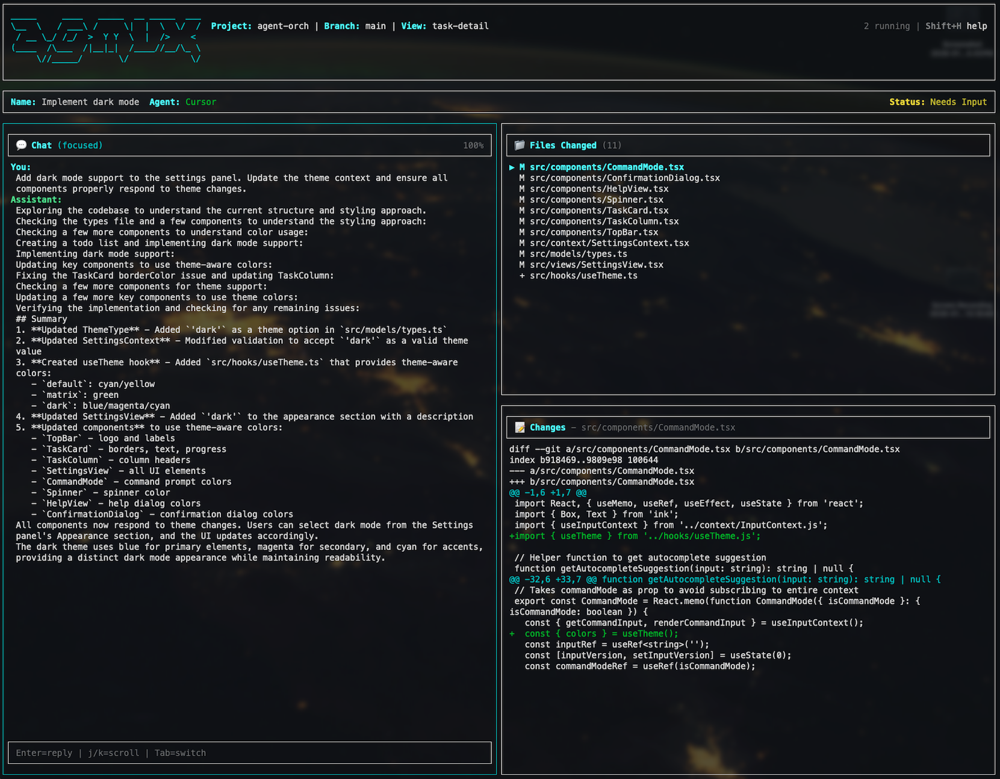

# agmux - Agent Multiplexer TUI

A local, terminal-based orchestration interface for managing, running, and observing multiple AI agents concurrently.

Built with React Ink (TypeScript/React) for a modern CLI experience.

Inspired by [k9s](https://k9scli.io/) and designed for developers using local AI agents (Claude, Codex, Cursor, etc.).

Create new agent tasks



View your agents working in parallel and respond when they are done and ready for you to review their work. 



Review your agents output and optionally merge their code, or give them feedback.



## Features

- **Vim-style navigation** - Keyboard-driven workflows
- **Pane-based UI** - Resource lists and detail views
- **Parallel execution** - Run multiple agents concurrently
- **Git worktree isolation** - Each run executes in its own isolated worktree
- **Real-time observability** - Progress tracking, logs, and interactive conversations
- **Customizable themes** - Matrix retro theme included

## Installation

```bash
npm install -g agmux
```

## Usage

Navigate to a git repository where you want to run AI agents, then:

```bash
agmux
```

## Keyboard Shortcuts

| Key | Action |
|-----|--------|
| `j/k` | Navigate up/down |
| `Enter` | Select/Open |
| `Esc` | Back/Cancel |
| `q` | Quit |
| `?` | Help |

## MCP Server

When running, the application exposes an MCP server at `http://localhost:3000/mcp` that allows AI assistants to manage tasks and skills.

### Adding to Claude Code

```bash
claude mcp add --transport http amux http://localhost:3000/mcp
```

### Available Tools

- `list_tasks` - Get all tasks
- `get_task` - Get a specific task by run ID
- `create_task` - Create a new task
- `start_task` - Start a queued task
- `add_or_update_skill` - Add or update a skill

## Requirements

- Node.js >= 18.0.0
- Git (for worktree isolation)

## License

Licensed under the Apache License, Version 2.0 (the "License");
you may not use this file except in compliance with the License.
You may obtain a copy of the License at

    http://www.apache.org/licenses/LICENSE-2.0

Unless required by applicable law or agreed to in writing, software
distributed under the License is distributed on an "AS IS" BASIS,
WITHOUT WARRANTIES OR CONDITIONS OF ANY KIND, either express or implied.
See the License for the specific language governing permissions and
limitations under the License.
